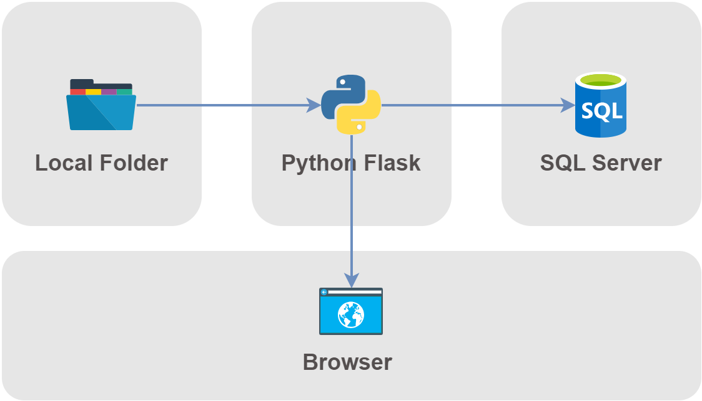
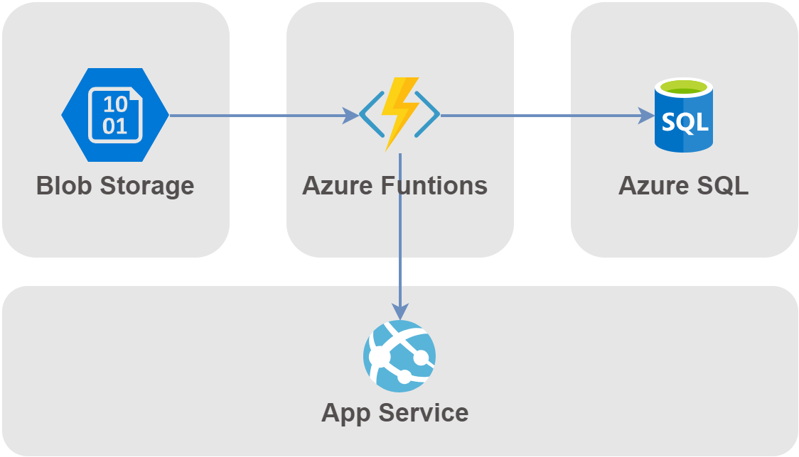

# DE CHALLENGE
> This is a code for a Data Engineer Challenge

## API: /upload/<table_name>
- Upload tables
- table_name: employees,departments,jobs
### Example
shortcode: `localhost:port/upload/departments`

## SQL: /show/dep-job
- Shows a table with information of departments, jobs and hired employees by quarter.
### Example
shortcode: `localhost:port/show/dep-job`

## SQL: /show/dep-hir
- Shows a table with information of departments with most hired employees.
### Example
shortcode: `localhost:port/show/dep-hir`

## Architecture

## Cloud architecture in Azure

